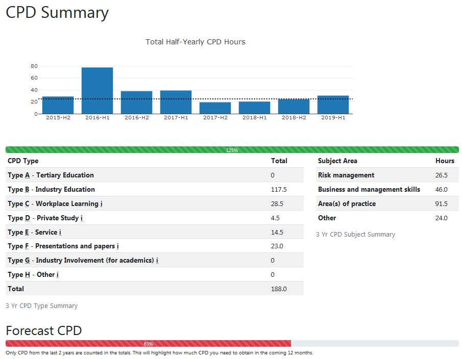

# CPD Log

Take an Engineers Australia CPD export and generate a summary report.

Creates a local sqlite database that lets you add new activities.

CPD Rules are based on the EA [Types & Conditions](https://www.engineersaustralia.org.au/sites/default/files/content-files/2016-12/cpd_types_and_conditions_march_2014.pdf)
