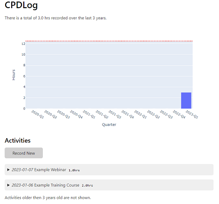
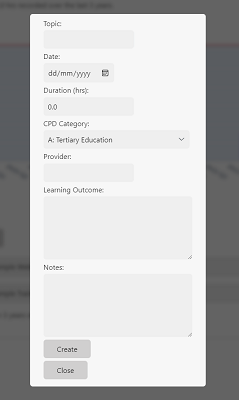

# CPD Log

This program can be used to record and analyse Continued Professional Development (CPD) Activities. It will create CSV file that lets you add new activities.


## Add an entry

```sh
cpdlog new --logfile example.csv
```

If the logfile does not exist yet it will create one. It will then prompt you to enter the activity details.

```
Date [2023-01-06]:
Topic: Example Training Course
Hours: 2
A: TertiaryEducation
B: IndustryEducation
C: WorkplaceLearning
D: PrivateStudy
E: Service to Industry
F: Papers
G: IndustryEngagement
H: Other
 (A, B, C, D, E, F, G, H) [B]:
Provider []: Company ABC
Learning outcome: I learnt some things
Added entry to example.csv
```


## Show recent entries

```sh
cpdlog recent --logfile example.csv --num 5
```

This will then show the most recent entries in the file, this can be useful if you want to check what CPD you have already entered. 

```
There are 2 entries in the CPD Log File 'example.csv'
2023-01-07      1.0hrs  Example Webinar
2023-01-06      2.0hrs  Example Training Course
```

## Web GUI

A web GUI is also available to be generated based on the CSV file. 

```python -m cpdlog gui --logfile example.csv```

 

CPD Rules are based on the EA [Types & Conditions](https://www.engineersaustralia.org.au/sites/default/files/content-files/2016-12/cpd_types_and_conditions_march_2014.pdf)


## Logfile location

If you don't want to parse the  `--logfile` argument every time, it will assume the CSV is located at `cpdlog.csv` in whatever directory you run the command from.

Alternatively, you can set the path to your logfile as an environment variable `CPD_LOG_FILE`.

